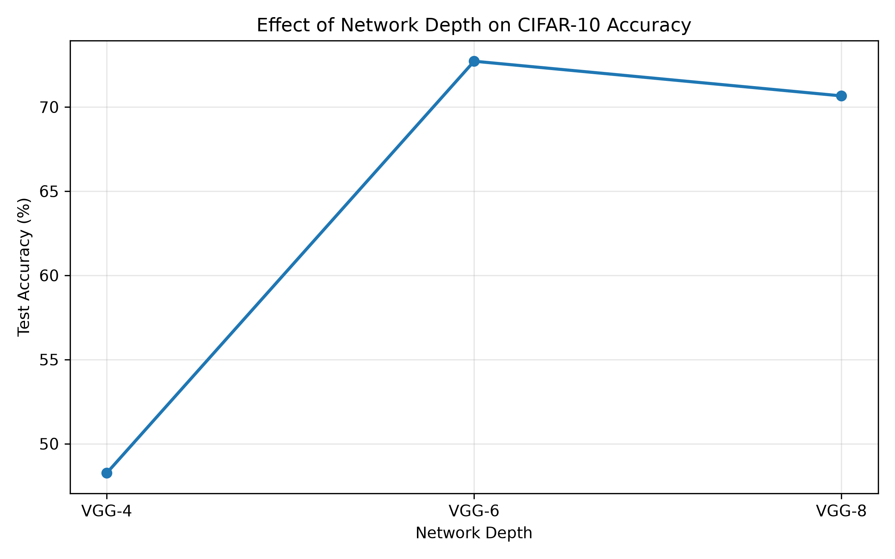
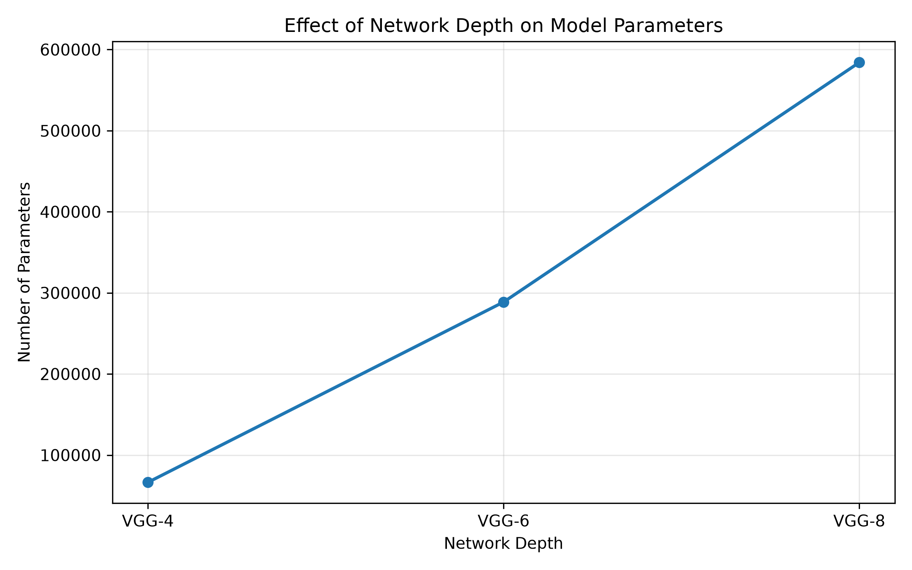
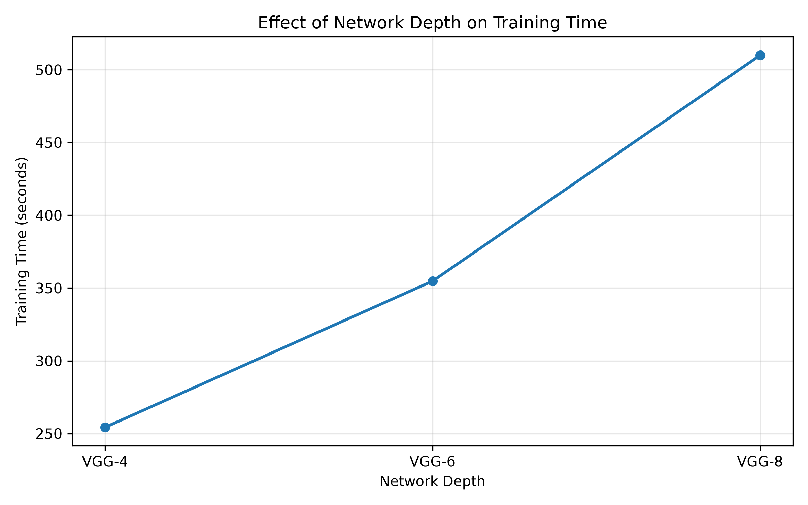

## 实验一：网络深度对图像分类性能的影响

为了验证VGG网络加深的设计思想，实验构建了VGG-4、VGG-6、VGG-8三种不同深度的网络，并在CIFAR-10的数据集上进行对比实验

### 实验结果

| Model | Parameters | Test Accuracy |
| ----- | ---------- | ------------- |
| VGG-4 | 66410      | 48.26%        |
| VGG-6 | 288746     | 72.72%        |
| VGG-8 | 584170     | 70.66%        |

### 实验结果可视化

### 实验一结果分析

在CIFAR-10数据集上进行了不同网络深度的对比实验。实验结果表明，VGG-4、VGG-6、VGG-8的测试准确率分别为48.26%、72.27%和70.66%。随着网络深度从4层到6层，模型分类性能得到了明显的提升，当网络增加至八层时，准确率没有继续提升。实验结果初步表明，适当增加网络深度能够增强模型的提取能力，但是并非网络深度越深越好，模型性能还受训练策略、模型规模和数据规模等因素影响。
